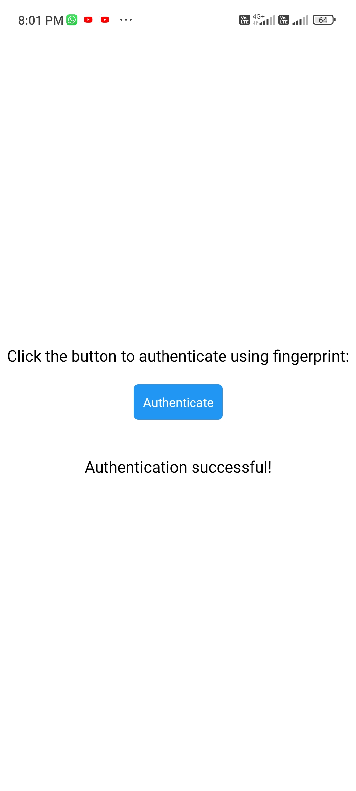
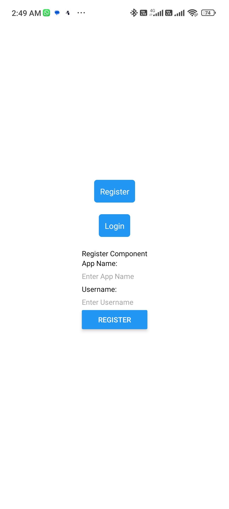
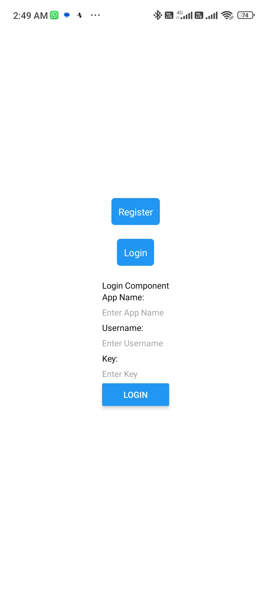

# pl-auth.app

Mobile App for [pl-auth](https://github.com/Lokeshwaran-M/pl-auth) services where the application provides a passwordless authentication servies were it uses a key token model for exchange of auth status and authenticate users using Biometric Prompt (Android) or FaceID it registers or logs the user in

> note : The pl-auth app and pl-auth services is under development not yet fully developed

## To Download apk 

download the apk file [pl-auth.app](./build/pl-auth.apk)

> note : the node api [pl-auth.api](https://github.com/Lokeshwaran-M/pl-auth.api.git) is not up and running and the url is still in localhost so the app will not preform the api requests

## Docs

[Documentation](https://github.com/Lokeshwaran-M/dev-docs/blob/main/expo-react-native-app/init.expo-react-native-app.docs.md) to build this app or any app using expo react native

## To Install and Run

To install and run this app in your local directory

```
git clone https://github.com/Lokeshwaran-M/pl-auth.app.git
npm start
```

## App ScreenShots


  








